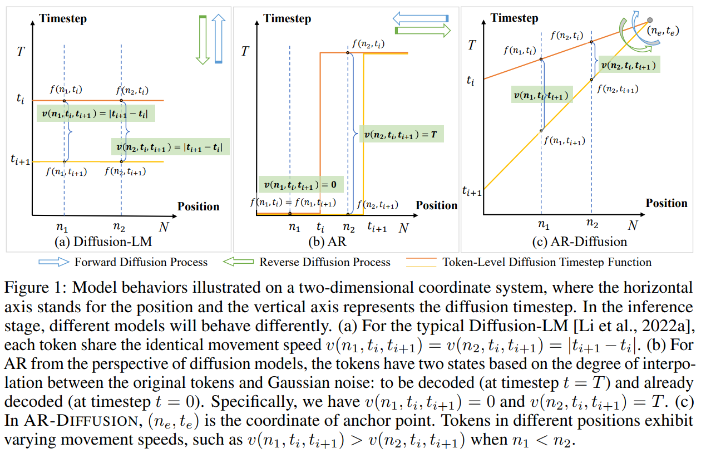

# AR-Diffusion

This repo provides the code and models for [AR-Diffusion: Auto-Regressive Diffusion Model for Text Generation](https://arxiv.org/abs/2305.09515). 

## 🚀 Overview

we introduce Auto-Regressive Diffusion (AR-Diffusion). AR-Diffusion ensures that the generation of tokens on the right depends on the generated ones on the left, a mechanism achieved through employing a dynamic number of denoising steps that vary based on token position. This results in tokens on the left undergoing fewer denoising steps than those on the right, thereby enabling them to generate earlier and subsequently influence the generation of tokens on the right. 

<div align=center></div>

In a series of experiments on various text generation tasks including text summarization, machine translation, and common sense generation, AR-Diffusion clearly demonstrated the superiority over existing diffusion language models and that it can be $100\times\sim 600\times$ faster when achieving comparable results.

You can find more details in the [paper](https://arxiv.org/abs/2305.09515).


## ⚙️ Experiment Preparation

**Dependencies:**

- conda create -n torch python=3.8
- conda activate torch
- pip install torch torchvision torchaudio --extra-index-url https://download.pytorch.org/whl/cu116
- pip install -r requirments.txt

**Downstream Task Dataset:**

The text generation benchmarks we use is well-known and widely used, including *XSum*, *CNN/DailyMail*, *IWSLT14* and *Commongen*. You can find more detailed information and obtain methods of the dataset [here](https://drive.google.com/).

**Model**

We have released the checkpoint of the AR-Diffusion for each dataset (6-layer encoder, and 6-layer decoder):

- AR-Diffusion XSum [[link](https://drive.google.com/)]
- AR-Diffusion CNN/DailyMail [[link](https://drive.google.com/)]
- AR-Diffusion IWSLT14 [[link](https://drive.google.com/)]
- AR-Diffusion Commongen [[link](https://drive.google.com/)]

## 💡 Training

In this section, we will use *XSum* dataset as an example to demonstrate the process of AR-Diffusion training on downstream tasks. (The training scripts for all datasets are available at ```scripts/train.sh```.) The running script for training is as follows:

```shell
FILE_NAME = xsum
STEP = 80000

torchrun --nproc_per_node=8 --nnodes=1 ./train_utils/trainer_main.py \
model.name='bert-base-uncased' batch_size=128 grad_accum=3 \
total_steps=$STEP exp.name=$FILE_NAME \
data.name=xsum tgt_len=50 max_pos_len=512 lr=8e-4 lr_step=40000 \
intermediate_size=2048 num_attention_heads=8 dropout=0.2 \
in_channels=128 out_channels=128 time_channels=128 \
eval_interval=3000 log_interval=1000 \
schedule_sampler='xy_uniform' time_att=True att_strategy='txl' use_AMP=True \
```

## 💬 Inference

In this section, we will show how to batch generate text from trained AR-Diffusion. We use *XSum* dataset as an example (The training scripts for all datasets are available at ```scripts/gen.sh```.). The running script for generating is as follows:

```shell
FILE_NAME = xsum
STEP = 80000

torchrun --nproc_per_node=8 --nnodes=1 ./gen_utils/generate.py \
model.name='bert-base-uncased' batch_size=800 \
exp.name=$FILE_NAME load_step=$STEP \
data.name=xsum tgt_len=50 max_pos_len=512 num_samples=50 \
intermediate_size=2048 num_attention_heads=8 dropout=0.2 \
in_channels=128 out_channels=128 time_channels=128 \
skip_sample=True gen_timesteps=20 \
schedule_sampler='xy_uniform' time_att=True att_strategy='txl' load_from_ema=True prediction=True \
```

## ⚽ Evaluation

In this section, we will show how to select the best samples by MBR on candidate samples and evaluate the selected samples. We use *XSum* dataset as an example (The training scripts for all datasets are available at ```scripts/concat_eval.sh```.).  The running script for evaluation is as follows:

```shell
FILE_NAME=xsum
DATA_NAME=xsum
STEP=80000
NUM=50

echo "model step" $STEP
j=0
while [ "$j" -lt $NUM ]; do
echo "gen num $j"
./.conda/envs/torch/bin/python ./eval_utils/concat.py \
--n_gpu=8 --num=$j \
--src_path=./my_output/$DATA_NAME/$FILE_NAME/$STEP\_ema_0.9999_skip__xy_20/num$j \
--tgt_path=./data/$DATA_NAME

j=$(($j+1))
done


./.conda/envs/torch/bin/python ./eval_utils/mbr/mbr_select.py \
--data_name=$DATA_NAME --num=$NUM --process=50 # --exp_name=500
```

## 📜 Citation

Please cite our paper if you use [AR-Diffusion](https://arxiv.org/abs/2305.09515) in your work:

```bibtex
@misc{wu2023ardiffusion,
      title={AR-Diffusion: Auto-Regressive Diffusion Model for Text Generation}, 
      author={Tong Wu and Zhihao Fan and Xiao Liu and Yeyun Gong and Yelong Shen and Jian Jiao and Hai-Tao Zheng and Juntao Li and Zhongyu Wei and Jian Guo and Nan Duan and Weizhu Chen},
      year={2023},
      eprint={2305.09515},
      archivePrefix={arXiv},
      primaryClass={cs.CL}
}
```
