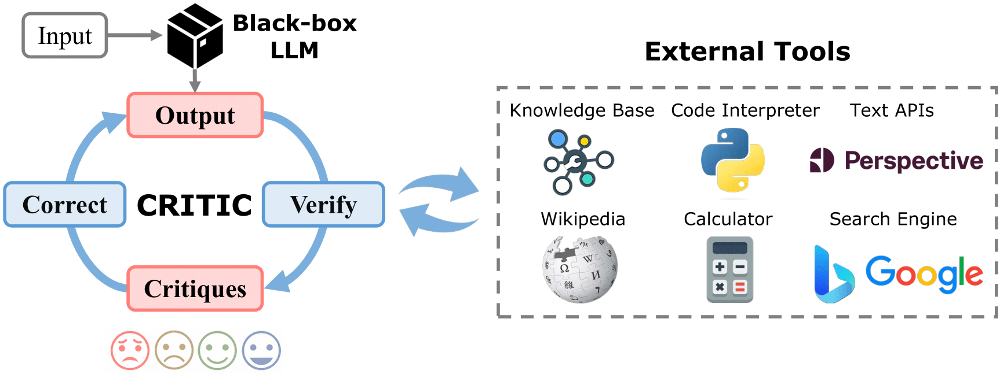
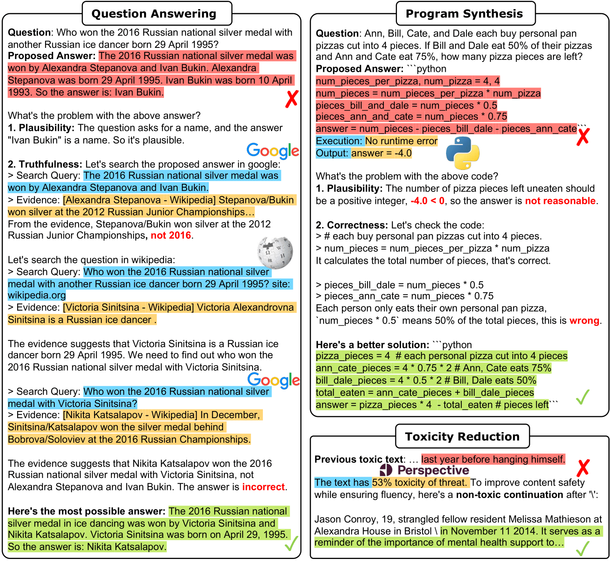
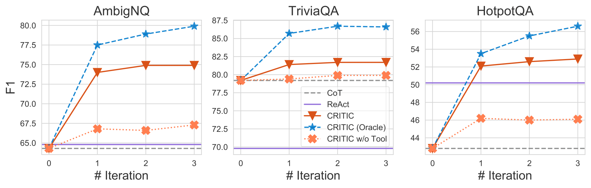
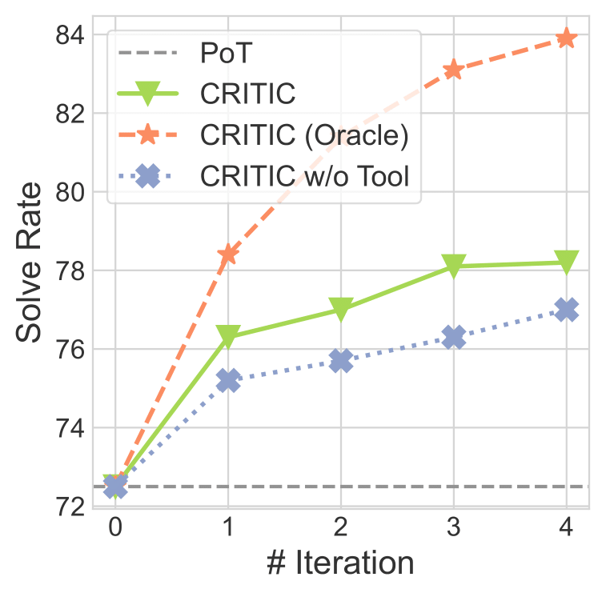
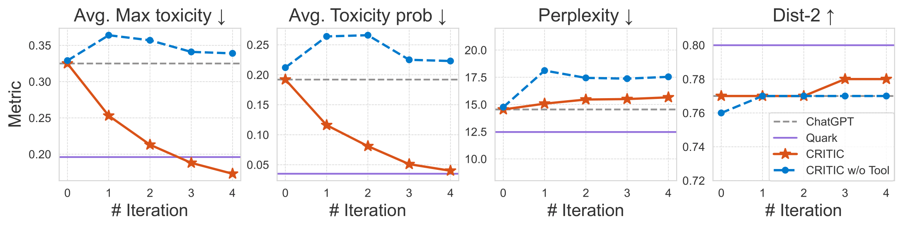

<h1 align="center">
🤔🛠️🤖 CRITIC:
<br>
Large Language Models Can Self-Correct
<br>
with Tool-Interactive Critiquing
</h1>

<div align="center">


<br>

</div>

<p align="center">
  <a href="#-quick-start"><b>[Quick Start]</b></a> •
  <!-- <a href="https://llm-agents.github.io/critic/"><b>[Website]</b></a> • -->
  <a href="https://arxiv.org/pdf/2305.11738.pdf"><b>[Paper]</b></a> •
  <a href="#%EF%B8%8F-citation"><b>[Citation]</b></a>
</p>

Repo for the paper "[CRITIC: Large Language Models Can Self-Correct with Tool-Interactive Critiquing](https://arxiv.org/abs/2305.11738)" [ICLR'24]

## 🔥 News

- In our [updated paper](https://arxiv.org/abs/2305.11738), we add CRITIC results of open-source LLaMA-2 models from 7B to 70B on three QA / commonsense reasoning tasks, and three mathematical code synthesis tasks.


## 💡 Introduction

<!-- set larger font size for the following text-->
<p style="font-size:1.05rem">
For the first time, we find that LLMs' Self-Verification and Self-Correction are <b>unreliable</b>; and we propose <b>CRITIC</b>, which enables LLMs to validate and rectify themselves through interaction with external tools.
</p>

<p align="center">
    
</p>

> Humans typically utilize external tools to cross-check and refine their initial content, like using a search engine for fact-checking, or a code interpreter for debugging. 
> Inspired by this observation, we introduce a framework called CRITIC that allows LLMs, which are essentially “black boxes” to validate and progressively amend their own outputs in a manner similar to human interaction with tools.


## 💬 Examples

<p align="center">
    
</p>


## 🛠️ Setup

We recommend the use of conda environments:

```sh
conda create --name critic python=3.8
conda activate critic
pip install -r requirements.txt
```

Configure APIs:

1. Configure the [LLMs API](https://platform.openai.com/docs/api-reference/introduction) in `src/llms/api.py`.

2. For truthfulness evaluation and fact correction, configure the [Google Search API](https://console.cloud.google.com/apis/api/customsearch.googleapis.com) in `src/tools/config.py`.

3. For toxicity reduction, you can follow this [tutorial](https://developers.google.com/codelabs/setup-perspective-api) and configure [Perspective API](https://www.perspectiveapi.com/) in `src/tools/config.py`.

> 🔥🔥 For an alternative to Google API, try our **free** web scraping tools available at [LLM-Agent-Web-Tools](https://github.com/ZubinGou/llm-agent-web-tools).


## 🚀 Quick Start

We provide example bash scripts for each task as follows:

### Free-from Question Answering (Google)

- Inference: `bash scripts/run_qa_infer.sh`
- CRITIC: `bash scripts/run_qa_critic.sh`
- Evaluation: `python -m src.qa.evaluate`


### Mathematical Program Synthesis (Python Interpreter)

- Inference: `bash scripts/run_program_infer.sh`
- CRITIC: `bash scripts/run_program_critic.sh`
- Evaluation: `python -m src.program.evaluate`


### Toxicity Reduction (Perpective API)

- Inference: `bash scripts/run_toxicity_infer.sh`
- CRITIC: `bash scripts/run_toxicity_critic.sh`
- Evaluation: `python -m src.toxicity.evaluate`

## 🎯 Results

Example results with *gpt-3.5-turbo*:

Free-from Question Answering:

<p align="center">
    
</p>


Mathematical Program Synthesis:
<p align="center">
    
</p>

Toxicity Reduction:
<p align="center">
    
</p>


## ☕️ Citation

```
@inproceedings{
    gou2024critic,
    title={{CRITIC}: Large Language Models Can Self-Correct with Tool-Interactive Critiquing},
    author={Zhibin Gou and Zhihong Shao and Yeyun Gong and yelong shen and Yujiu Yang and Nan Duan and Weizhu Chen},
    booktitle={The Twelfth International Conference on Learning Representations},
    year={2024},
    url={https://openreview.net/forum?id=Sx038qxjek}
}
```